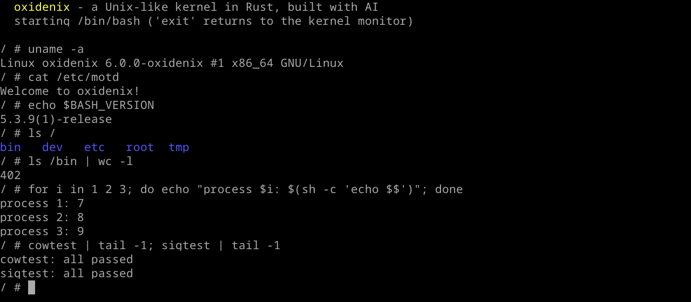

<div align="center">

# oxidenix

**A Unix-like x86_64 kernel written from scratch in Rust, designed, implemented and debugged by an AI.**

It boots in QEMU and runs an unmodified, statically linked **GNU Bash 5.3** and **BusyBox**
on top of a Linux-compatible system call interface.

-orange?logo=rust)




</div>

---

## About this project

oxidenix is a **research project about AI-driven systems programming**. The question behind it:
*how far can an AI coding agent get when it is asked to build an operating system kernel from an
empty directory, with a human only setting goals?*

- **Every line of code** in this repository (kernel, build tooling, test programs, this README)
  was written by **Claude** (Anthropic), working as an agent in **Claude Code**.
- The human collaborator set the direction in short sentences ("I want a minimal shell",
  "make Bash run", "do copy-on-write, then job control"), chose between design options and
  tested the result by typing into the QEMU window.
- The AI did the design, the implementation and the debugging. Debugging included reading
  QEMU monitor dumps (`info registers`, `info pic`), disassembling crash addresses with
  `addr2line`/`objdump`, and driving the guest through the QEMU monitor (`sendkey`,
  `screendump`) to look at screenshots of its own output.
- Automated security reviews ran on every commit. The kernel panics, overflows, deadlocks and
  resource exhaustion paths they found were fixed in follow-up commits (see
  [Security](#security)).

The project went from an empty directory to an interactive Bash in one long working session.
Its [commit history](#development-history) records every step.

## What it can do

- **Boots** via BIOS into a 64-bit higher-half kernel with a framebuffer text console.
- **Runs real Linux binaries**: static musl executables such as GNU Bash 5.3 (with readline),
  BusyBox 1.37 (~400 applets: `ls`, `cat`, `grep`, `sed`, `dd`, `vi`, ...) and its own C test
  programs, all unmodified.
- **Interactive shell** with line editing, history (arrow keys), tab completion, colors, pipes,
  redirections, subshells, command substitution and arithmetic.
- **Preemptive multitasking**: round-robin scheduler at 100 Hz, separate address spaces,
  `fork` with **copy-on-write**, `execve`, `wait4`, process groups and sessions.
- **POSIX signals**: handlers, masks, `kill`, `SIGCHLD`, `EINTR`, and **Ctrl+C** interrupting
  any foreground program, even a busy loop without system calls.
- **Filesystem**: an in-memory, tmpfs-like VFS populated from a cpio initramfs, with files,
  directories, symlinks, `/dev/{console,tty,null,zero}`, and quotas against heap exhaustion.
- **Terminal**: a termios line discipline (canonical and raw mode, echo, erase/kill/word-erase,
  EOF), the ANSI escape sequences BusyBox and readline use, a German keyboard layout and UTF-8.
- **~90 Linux system calls**, enough for Bash and BusyBox (see [System calls](#system-calls)).

## Quick start

### Requirements

- **Rust nightly** with `rust-src` and `llvm-tools-preview` (pinned in `rust-toolchain.toml`).
- **QEMU** (`qemu-system-x86_64`).
- **Nix**: the userland is fetched and cross-compiled from nixpkgs
  (`pkgsStatic.stdenv.cc` for musl, `pkgsStatic.busybox`, `pkgsStatic.bash`).

### Build and run

```sh
cd kernel
cargo run
```

This builds the kernel, assembles the root filesystem (C test programs, Bash, BusyBox and
`userspace/rootfs/`), packs it as a cpio initramfs, creates a BIOS disk image and starts QEMU.
Extra arguments after `--` are passed to QEMU.

The kernel boots straight into Bash. Things to try:

```sh
ls -l /bin | head          # BusyBox applets
cowtest; sigtest; forktest # kernel self-tests in user space
sh /etc/test.sh            # filesystem, pipes, quotas, rename semantics
sleep 100                  # then press Ctrl+C
exit                       # drops to the built-in kernel monitor ('help', 'mem', 'run bash')
```

The window scales when it is resized (`zoom-to-fit`), and Ctrl+Alt+F toggles fullscreen.

## Architecture

### Big picture

```
 ┌───────────────────────────── user space (ring 3) ─────────────────────────────┐
 │   GNU Bash 5.3      BusyBox 1.37      cowtest / sigtest / forktest / hello    │
 │                  statically linked against musl libc                           │
 └──────────────────────────────┬──────────────────────────────▲──────────────────┘
                     syscall / page fault / IRQ            iretq (+ signal frames)
 ┌──────────────────────────────▼──────────────────────────────┴──────────────────┐
 │  syscall layer   process/syscall.rs ─ sys_file.rs ─ sys_mem.rs ─ signal.rs     │
 │  processes       scheduler, fork/exec/wait, sleep/wakeup channels, pgid/sid     │
 │  memory          frame allocator (refcounted), heap, address spaces, COW       │
 │  VFS             inodes, path resolution, open files, pipes, cpio initramfs     │
 │  terminal        TTY line discipline ─ console (framebuffer, ANSI) ─ keyboard   │
 │  CPU             GDT/TSS, IDT, PIC, PIT, syscall MSRs, SSE                       │
 └─────────────────────────────────────────────────────────────────────────────────┘
                     bootloader 0.11 (BIOS), QEMU x86_64, 256 MiB RAM
```

### Repository layout

```
oxidenix/
├── kernel/                      the kernel (no_std, target x86_64-unknown-none)
│   └── src/
│       ├── main.rs              entry point, boot configuration, init order
│       ├── interrupts/          GDT/TSS (gdt.rs), IDT + PIC + PIT (mod.rs),
│       │                        exception, timer and keyboard handlers (handlers.rs)
│       ├── memory/              physical frame allocator with refcounts (frame.rs),
│       │                        kernel heap and page table access (mod.rs)
│       ├── process/             scheduler and process lifecycle (mod.rs),
│       │   ├── address_space.rs per-process page tables, copy-on-write
│       │   ├── syscall.rs       syscall entry/return, dispatch table
│       │   ├── sys_file.rs      file, directory, pipe, tty-ioctl, poll/select
│       │   ├── sys_mem.rs       brk, mmap, munmap
│       │   ├── signal.rs        signal state, delivery, sigreturn, kill
│       │   ├── loader.rs        ELF loading and the Linux initial stack
│       │   ├── elf.rs           ELF64 parser
│       │   └── uaccess.rs       checked access to user memory
│       ├── fs/                  VFS (mod.rs), open files and pipes (file.rs),
│       │                        initramfs unpacker (cpio.rs)
│       ├── drivers/             framebuffer console (console.rs), TTY (tty.rs),
│       │                        PS/2 keyboard (keyboard.rs)
│       └── shell/               built-in kernel monitor (fallback shell)
├── builder/                     host tool: rootfs + cpio + disk image + QEMU launch
└── userspace/                   C test programs, build script, rootfs template
```

About 5,000 lines of Rust in the kernel plus a small host-side builder.

### Boot sequence

1. The **bootloader** (BIOS, `bootloader` 0.11) loads the position-independent kernel ELF into
   the upper half (`dynamic_range_start = 0xffff_8000_0000_0000`). It maps all physical
   memory at a dynamic offset, sets up a VESA framebuffer and loads the initramfs as a ramdisk.
2. `kernel_main` runs these steps in order: framebuffer console → GDT/TSS/IDT and PIC/PIT
   (interrupts still off) → frame allocator and 16 MiB kernel heap → VFS from the cpio
   ramdisk → process subsystem (SSE, syscall MSRs, process 0) → **interrupts on**.
3. Process 0 (the kernel monitor) spawns `/bin/bash` as the foreground process and waits for
   it. If Bash exits, the monitor takes over the terminal.

### Memory

| Region | Address | Notes |
|---|---|---|
| User ELF image | from `0x40_0000` | static `ET_EXEC` binaries, segments mapped with W/NX from program headers |
| `brk` heap | after the highest segment | grows on demand |
| `mmap` area | top-down from `0x7000_0000_0000` | anonymous and private file mappings |
| User stack | below `0x7fff_ffff_f000` | 256 KiB, Linux initial stack (argc, argv, envp, auxv) |
| Kernel image, stacks, boot info, framebuffer, physical memory map | upper half, chosen by the bootloader | shared by all address spaces |
| Kernel heap | `0xffff_c000_0000_0000` | starts at 8 MiB and grows on demand (up to 1 GiB virtual) |

- **Frame allocator**: a bump allocator over the usable regions of the boot memory map, plus a
  free list threaded through the freed frames themselves. Every frame carries a **reference
  count**; freeing drops one reference.
- **Address spaces**: each process has its own level-4 table. The lower half belongs to the
  process, the upper half entries are copied from the kernel's table. Dropping an address space
  walks the lower half and releases every table and frame.
- **Copy-on-write**: `fork` shares all user frames. Writable pages become read-only in both
  processes and are tagged with an OS-available page table bit. A write fault either copies the
  frame or, for the last owner, just restores write access. Kernel writes into user memory
  resolve COW first, because they would not fault.
- **Out of memory is an error, not a panic**: the kernel heap grows by mapping more frames
  when an allocation fails. User memory (pages, page tables, kernel stacks for `fork`) may not
  take the last 16 MiB of RAM, which stay reserved for the heap. Large allocations that user space
  can trigger (kernel stacks, file contents, pipe buffers, `execve` arguments) are fallible and
  return `ENOMEM`/`E2BIG`, and at most 256 processes can exist (`EAGAIN` beyond that).
- **User memory access** (`uaccess.rs`) checks every page of a user range against the active
  page tables before the kernel touches it. Bad pointers yield `EFAULT`, never a kernel fault.

### Processes and scheduling

- **One kernel stack per process** (64 KiB). A context switch saves callee-saved registers,
  the FPU/SSE state (`fxsave`), the FS base (musl's TLS pointer), and switches CR3, `TSS.rsp0`
  and the syscall stack pointer.
- **Round-robin scheduling** driven by the PIT at 100 Hz. Only user code is preempted. The
  kernel itself is non-preemptive and runs syscalls with interrupts disabled, which keeps the
  single-core design free of most locking.
- **Blocking** uses `sleep_on(channel)` / `wakeup(channel)` (pipes, TTY, timer ticks). Waiting
  for children has its own state.
- New processes start by *returning from a syscall*: their kernel stack is pre-filled with a
  register frame that `user_return` consumes. A `fork` child is the parent's frame with
  `rax = 0`.
- Process groups, sessions and the terminal's foreground group follow POSIX closely enough for
  Bash and BusyBox job handling.

### System call path

- `syscall` enters `syscall_entry`, which switches to the process's kernel stack and builds a
  **20-word frame**: all general-purpose registers plus `rip, cs, rflags, rsp, ss`. That tail is
  exactly what the CPU pushes on an interrupt from ring 3.
- The timer interrupt has its own assembly entry that completes the CPU frame to the same layout.
- Both paths return through `user_return`, which uses **`iretq`** (not `sysret`). A signal can
  therefore interrupt user code at any instruction and `rt_sigreturn` restores every register
  exactly, and the classic `sysret` non-canonical-address problem cannot occur.
- The dispatch table maps Linux x86_64 syscall numbers to Rust functions returning
  `Result<i64, errno>`.

### Signals

- Per process: 64 actions, a blocked mask and a pending set. `fork` inherits actions and mask,
  `exec` resets caught signals.
- **Delivery** happens on every return to user space (after syscalls and after timer
  preemption). Default actions terminate or ignore. For handlers, the kernel pushes a signal
  frame on the user stack: restorer address, saved register frame, saved mask and `siginfo`.
- Blocking calls (TTY and pipe I/O, `wait4`, `nanosleep`, `poll`/`select`, `pause`) return
  `EINTR`, but only after checking for available data or a finished child first.
- The TTY turns Ctrl+C, Ctrl+\ and Ctrl+Z into `SIGINT`, `SIGQUIT` and `SIGTSTP` for the
  foreground process group.

### Filesystem

- **VFS**: reference-counted inodes (`Arc<Inode>`) holding directories (`BTreeMap`), files,
  symlinks or devices. Path resolution follows symlinks with loop detection and supports the
  `*at` family relative to directory descriptors.
- **Initramfs**: the builder writes a `newc` cpio archive, and the kernel unpacks it at boot
  without copying file contents. Files reference the ramdisk until their first write
  (copy-on-write).
- **Open files** are shared descriptions (`Arc<OpenFile>`) with offset and flags, so `dup`,
  `fork` and close-on-exec behave as on Linux.
- **Pipes** have a 64 KiB buffer with blocking reads and writes and EOF/`EPIPE` semantics.
- **Quotas**: file contents and inode metadata are charged against an 8 MiB budget (`ENOSPC`),
  and single files are limited to 64 MiB (`EFBIG`). Without this, user programs could exhaust
  the kernel heap.

### Terminal and console

- **Console**: a cell grid on the framebuffer with a 24 px Noto Sans Mono bitmap font, 16 ANSI
  colors, a visible cursor, deferred line wrap, UTF-8 (Latin-1), cursor movement, erase,
  insert/delete characters, SGR attributes and cursor position reports.
- **TTY**: a termios subset (`TCGETS`/`TCSETS*`, `ICANON`, `ECHO*`, `ISIG`, `ICRNL`, `VMIN`, ...)
  with canonical line editing, raw mode for readline, EOF handling and `FIONREAD`. Its buffers
  have fixed sizes because the keyboard path runs in interrupt context and must not allocate.
- **Keyboard**: PS/2 scancodes are decoded in the IRQ handler with the German (`De105Key`)
  layout and translated to terminal bytes: CR, DEL, and VT100 sequences for arrows and editing
  keys.

### Userland build

`userspace/build.sh` cross-compiles every `userspace/*.c` with the musl toolchain from nixpkgs
and copies static Bash and BusyBox (with symlinks for all applets) into the root filesystem. The
builder adds `userspace/rootfs/` (`/etc/passwd`, `/etc/motd`, `/etc/test.sh`, ...), writes the
cpio archive and hands it to the bootloader as a ramdisk.

## System calls

Linux x86_64 numbers, grouped by area (about 90 in total):

| Area | Calls |
|---|---|
| Files | `read` `write` `readv` `writev` `open` `openat` `close` `lseek` `sendfile` `ftruncate` `fcntl` `ioctl` `dup` `dup2` `dup3` `pipe` `pipe2` |
| Metadata | `stat` `fstat` `lstat` `newfstatat` `access` `faccessat` `faccessat2` `readlink` `readlinkat` `chmod` `fchmodat` `utimes` `futimesat` `utimensat` `umask` |
| Directories | `getdents64` `getcwd` `chdir` `fchdir` `mkdir` `mkdirat` `rmdir` `unlink` `unlinkat` `rename` `renameat` `renameat2` `symlink` `symlinkat` |
| I/O multiplexing | `poll` `ppoll` `select` `pselect6` |
| Memory | `brk` `mmap` `munmap` `mprotect` (no-op) |
| Processes | `fork` `execve` `exit` `exit_group` `wait4` `getpid` `getppid` `gettid` `set_tid_address` `sched_yield` `arch_prctl` `prlimit64` `getrusage` |
| Groups and IDs | `setpgid` `getpgid` `getpgrp` `setsid` `getsid` `getuid` `geteuid` `getgid` `getegid` `getresuid` `getresgid` `setuid` `setgid` |
| Signals | `rt_sigaction` `rt_sigprocmask` `rt_sigreturn` `kill` `tkill` `tgkill` `pause` `sigaltstack` |
| Time and misc | `nanosleep` `clock_gettime` `uname` `getrandom` `socket` (fails with `EAFNOSUPPORT`) |

Everything runs as root. Unknown syscalls print a kernel message and return `ENOSYS`.

## Testing

Each of these programs and scripts lives in the root filesystem and runs inside oxidenix:

| Test | Covers |
|---|---|
| `cowtest` | copy-on-write isolation between parent and child, kernel writes into shared pages, 50 forks, shared read-only frames under `brk` |
| `oomtest` | fork bomb (stops at the process limit), memory exhaustion via `mmap`, 100 full pipes; the kernel survives and memory is reusable |
| `sigtest` | handlers, killing a busy loop, `SIGCHLD`, `EINTR` on pipe reads, blocked and ignored signals |
| `forktest` | `fork`, `execve`, `wait4`, preemptive interleaving of two workers |
| `sh /etc/test.sh` | files, pipes, `cd`, `mkdir`/`touch`/`rm`, rename cycles via symlinks, file quota |
| `mem` (kernel monitor) | frame and heap accounting, allocator self-test, leak checks after workloads |

During development the AI drove these tests through the QEMU monitor socket (`sendkey`,
`screendump`) and checked the screenshots.

Performance on QEMU (TCG), 30 iterations in Bash: a subshell `fork` takes about 1.3 ms, and
`fork` + `exec` of `/bin/true` about 5.7 ms.

## Security

oxidenix is a research kernel and is **not hardened for hostile workloads**. Still, every commit
went through an automated security review, and these classes of user-triggerable failures were
fixed:

- arithmetic overflows that panicked the kernel (`nanosleep`, `brk`/`mmap` sizes, `kill(INT_MIN)`, `sigreturn` stack pointer)
- `iretq` to non-user addresses (signal handlers, ELF entry points, restored contexts), which
  would fault in ring 0
- kernel heap exhaustion through huge or numerous files, pipes, processes or arguments (quotas,
  process limit, `ARG_MAX`, a frame reserve for the heap and fallible allocations)
- directory cycles through `rename` (also via symlinks) and recursion deep enough to overflow
  the kernel stack
- spinlock self-deadlocks and sleeping while holding an inode lock
- the `sysret` non-canonical return problem, which the `iretq` return path avoids entirely

Known open issues: `getrandom` and `AT_RANDOM` are not cryptographically secure, the kernel heap
never returns grown memory to the frame allocator, and there are no users or permissions
(everything runs as root).

## Limitations and roadmap

- [x] Copy-on-write `fork`
- [x] `ENOMEM` instead of a kernel panic when memory runs out
- [ ] Job control: stopping (Ctrl+Z), `fg`/`bg`, `SIGCONT`
- [ ] Persistent storage: a disk driver and an on-disk filesystem
- [ ] Networking, SMP, dynamic linking, real entropy, users and permissions

## Development history

| Step | Commit message |
|---|---|
| Visible boot | make the shell visible and keyboard input work under bootloader 0.11 |
| Memory | physical frame allocator and kernel heap |
| User space | run static musl programs in ring 3 |
| Processes | processes with preemptive scheduling, fork, execve and wait4 |
| Filesystem | in-memory filesystem, initramfs, file descriptors and pipes |
| Terminal | TTY with line discipline and an interactive BusyBox shell at boot |
| Signals | POSIX signals with handlers, Ctrl+C and EINTR |
| Bash | boot into an interactive Bash; harden signal and exec paths |
| Copy-on-write | copy-on-write fork and an optimized dev profile |
| Out of memory | grow the kernel heap and turn memory exhaustion into errors |

Run `git log` for the full history, including the security fixes between these steps.

## Acknowledgements

oxidenix builds on excellent open source work: the
[`bootloader`](https://github.com/rust-osdev/bootloader) and
[`x86_64`](https://github.com/rust-osdev/x86_64) crates of the rust-osdev community,
`pc-keyboard`, `pic8259`, `linked_list_allocator`, `heapless`, `spin`,
`noto-sans-mono-bitmap`, and in user space [musl](https://musl.libc.org/),
[BusyBox](https://busybox.net/) and [GNU Bash](https://www.gnu.org/software/bash/) as packaged
by [nixpkgs](https://github.com/NixOS/nixpkgs).

No license has been chosen for this repository yet.
